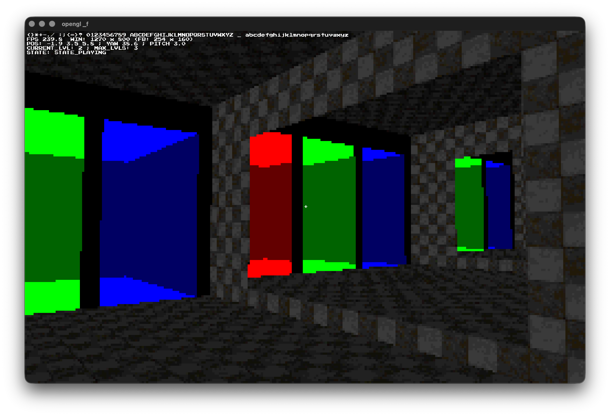

#### First try in openGL (why did I start with vulkan ??)
- repository for vulkan: https://github.com/FelixJaschul/vulkanc.git
- last showcase of engine: https://youtu.be/8PBLB3s_mOI?si=S4tZ2i-HrfA8beAI

#### THIS IS IT:

#### NOTES:
- `git clone --recursive ...` is required to fetch the GLFW submodule.
- Linux build requirements : OpenGL loader/headers, X11
